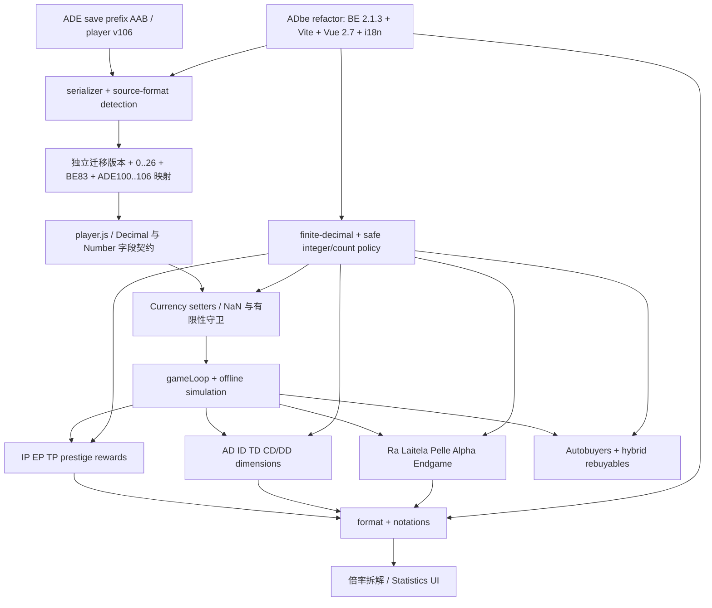

# ADE → AD-breaketernity 开工准备报告

日期：2026-09-20（Asia/Singapore）

## 结论先行

迁移可行，但“把本地 ADE 直接换底到 ADbe refactor”不是最低成本路径，也不会仅靠换成 `break_eternity` 自动解决溢出。

本地 ADE 才是目标功能与行为真源。它不是公开 Fork `master` 的简单副本：当前本地 HEAD 在 `feat/restore-multiplier-breakdown`，相对 ADE 上游共同基线有 10 个本地提交、97 个源码文件变化、约 `+7,304/-1,330` 行，另有 35 个测试文件、4,497 行测试。公开 Fork `master` 与上游相同，只能作为共同基线，不能代表本地实际工作。

建议采用：

1. 以本地 HEAD `ab358cf…` 为行为基线和持续可运行主线；
2. 把 ADbe refactor `14fcf115…` 当成“供体”，按数值内核、存档迁移、构建工具等独立能力分批吸收；
3. 如果最终必须让 Git 历史字面上从 ADbe refactor 开始，则直接按本地 HEAD 的垂直功能切片迁入，不要先移植公开 ADE 再重放用户改动；但这一方案预计需要约 85–145 人日。

最低成本的“ADbe 能力迁入本地 Fork”预计约 22–38 人日；若同时引入 Vite/Vue 2.7/i18n 等完整 refactor 基础设施，约 30–53 人日。以上均不含大范围平衡重做。

## 1. 已核实的工作区状态

### 本地仓库

- 路径：`E:\projects\tools\AntimatterDimensionsEndgameUpdate\AntimatterDimensionsEndgameUpdate`
- 当前分支：`feat/restore-multiplier-breakdown`
- HEAD：`ab358cf39a766e8c4c0e8b8fc44a95f185d82a41`
- 上游跟踪：`origin/feat/restore-multiplier-breakdown`
- 相对跟踪分支：ahead 0 / behind 0（最终复核时公开功能分支已与本地 HEAD 同步）
- 已跟踪工作树：无修改
- 暂存区：无修改
- 非忽略的未跟踪文件：无
- stash：无
- 已登记 worktree：只有原工作树
- 被忽略的本地测试夹具：`tests/fixtures/local-overflow-save.txt`，49,602 字节；未读取或展示其内容，仅在隔离副本中用于测试

### remotes

| 名称 | URL |
|---|---|
| `origin` | `https://github.com/ChuanYuanNotBoat/AntimatterDimensionsEndgameUpdate.git` |
| `upstream` | `https://github.com/Supersonic-Seven/AntimatterDimensionsEndgameUpdate.git` |
| `vanilla` | `https://github.com/IvarK/AntimatterDimensionsSourceCode.git` |

未对原仓库执行 fetch、checkout、reset、clean、push 或文件写入。

## 2. 可复现 SHA 与三方差异

| 角色 | ref / SHA | 说明 |
|---|---|---|
| ADE 上游共同基线 | `Supersonic-Seven/master` = `b7d4bfd2fbd66a3c4f8b73a6a9a7f79536165745` | ADE v1.2-patch-8 |
| Chuan 公开 master | `b7d4bfd2fbd66a3c4f8b73a6a9a7f79536165745` | 与上游相同，但不代表本地工作 |
| 本地 master | `d975ac75854d79d07808fdc142cfefdaa1c356ba` | 在共同基线上领先 1 个本地提交 |
| Chuan 公开功能分支 | `ab358cf39a766e8c4c0e8b8fc44a95f185d82a41` | 最终远端复核时已与本地 HEAD 相同；在共同基线上领先 10 个提交 |
| 本地行为真源 | `ab358cf39a766e8c4c0e8b8fc44a95f185d82a41` | 在共同基线上领先 10 个提交；是否已推送不改变其行为真源地位 |
| Chuan 部署分支 | `9584fe08b8bd0f4322f5a16e337c483cd7e4601b` | orphan 静态产物；`commit.json` 指向 `188f223d…` |
| ADbe main | `982ec3fdd8b2d163bee7cde67ddbddf6df75c0bf` | refactor 的旧主线 |
| ADbe refactor / 默认分支 | `14fcf1156011a36240e23c712dcf1e54fa01782f` | 当前候选基础 |

以上远端头均用 `git ls-remote` 在本次检查中重新验证。

### 三方视图

1. **ADE 上游 → 本地 HEAD**：10 个提交，133 个文件，`+11,806/-1,330`；其中源码 97 个文件、测试 35 个文件。
2. **本地 HEAD ↔ ADbe refactor**：本地共有 889 个 `src` 文件，ADbe 有 717 个；660 个路径同名，其中仅 135 个 blob 完全一致、525 个内容不同；本地独有 229 个源码文件，ADbe 独有 57 个。
3. **ADbe main → refactor**：refactor 与 main 已分叉；相对共同祖先，refactor ahead 141、behind 1。GitHub compare API 返回了上限 300 个变化文件，因此实际变化至少为 300 个文件。

把本地 `src` 变成 ADbe refactor `src` 的纯目录 diff 涉及 811 个文件、约 `+18,524/-74,950` 行。这不是“换 Decimal 库”的规模，而是内容层、架构层、UI 层和工具链同时分叉。

### 直接补丁 PoC

在隔离的 ADbe refactor 源码快照上，对本地 `upstream/master..HEAD` 的 `src/` 补丁执行了 `git apply --check`，没有应用任何修改：

| 指标 | 结果 |
|---|---:|
| 检查的源码文件 | 97 |
| 可按原上下文直接应用 | 31（32%） |
| 失败 | 66 |
| 目标文件不存在 | 9 |
| 同路径上下文冲突 | 57 |

“能 apply”也不等于能运行；其中很多是新增的倍率分析文件，仍依赖 ADE 专属数据库、Endgame 状态和 UI 入口。

## 3. 本地 Fork 自定义内容清单

| 提交/分支 | 类型 | 实际内容与依赖 | 迁移判断 |
|---|---|---|---|
| `d975ac75` | 调试/行为覆盖 | 在 `gameLoop` 中用 `false &&` 禁用被动 TP；针对边缘存档 | 必须先决定是否保留为正式规则，不能静默搬运 |
| `db7a9c6d`, `7b91333f` | Bugfix | 倍率拆解中的 Decimal 兼容 | 与 Statistics UI、multiplier tree 紧耦合 |
| `fa781ef0`, `425a6cab`, `182351b0`, `0fc004c2` | 功能 | 有序 IP/EP 拆解、公式路径、AD/ID/TD/Replicanti/DT 等审计视图 | 应作为一个完整功能簇迁移，不能逐文件零散 cherry-pick |
| `a542c48e` | 数值 Bugfix | Ra alchemy 避免 `Infinity/Infinity`、Poisson 输入 Infinity、Number 存储越界 | 可独立抽取，但需核对 ADbe 对 alchemy 字段已改为 Decimal 的差异 |
| `188f223d` | 大型 WIP 修复簇 | 103 文件；数值边界、维度、Glyph、Laitela、Replicanti、gameLoop、只读存档检查模式及大量测试 | 是本地当前数值策略核心；需按域拆解迁移 |
| `ab358cf3` | 最新 Bugfix | Machine cap、Bulk Singularity `log10(0)`、更多 reality smoke 诊断 | 必须包含在真源中；最终远端复核时公开功能分支已包含该提交 |
| `origin/ade-web` | 部署 | 150 个静态文件，约 82.2 MB，无源码共同祖先；由 `188f223d` 构建 | 不移植；目标代码稳定后重新构建部署产物 |

本地这 10 个提交没有修改 `src/core/player.js`。因此，用户自定义层本身没有新增 player schema；存档迁移的大头来自“完整 ADE Endgame schema”与 ADbe schema 的差异，而不是来自这 10 个提交。

## 4. ADbe refactor 作为候选基础的现实状态

已由源码验证：

- ADbe 默认分支是 `refactor`；README 明确说更新集中在此分支，完成后才会合并回 `main`。
- ADbe refactor 使用 Vite、Vue 2.7.16、`break_eternity.js` 2.1.3。
- 本地 ADE 使用 Vue CLI/webpack、Vue 2.6.11、`break_eternity.js` 2.1.1。
- ADbe refactor 大量引入 i18n、移除/重排 UI、商店、存档与 Automator 组件。
- ADbe `player.version` 为 83；ADE 为 106。
- ADbe `beMigration` 占用 migration 83；ADE Endgame migrations 使用 100–106。

这说明 ADbe refactor 更适合作为“持续变化的供体”而不是当前立即换底的稳定发布基线。若必须以它为基础，应先固定 SHA，不跟随默认分支滚动。

## 5. 两边都已使用 break_eternity

| 项目 | package spec | lockfile 实际版本 |
|---|---|---|
| 本地 ADE | `^2.1.1` | `2.1.1` |
| ADbe refactor | `^2.1.3` | `2.1.3` |

因此不存在“从 break_infinity 换到 break_eternity 就解决溢出”的收益。两边已经是 BE；真实问题是边界契约。

静态扫描结果如下。命中不等于一定是 bug，但可作为审计队列：

| 风险模式 | ADE 上游 | 本地 HEAD | ADbe refactor |
|---|---:|---:|---:|
| `.toNumber()` | 525 | 473 | 157 |
| `Math.log/log10/log2` | 95 | 91 | 52 |
| `Math.pow/exp` | 198 | 194 | 65 |
| `Math.min/max` | 249 | 258 | 122 |
| `Decimal.log/log10/ln` | 345 | 350 | 81 |
| `Number(...)` | 55 | 58 | 69 |

本地修复已把 `.toNumber()` 命中从 525 降到 473，但仍有 126 个文件包含此调用。高密度区域包括 celestial navigation、`game.js`、时间/记录、singularity milestones、glyph effects、Replicanti 和 Endgame 公式。

### 数值风险清单

1. **Decimal → Number 收窄**：超过 `Number.MAX_VALUE` 变 Infinity；超过 `MAX_SAFE_INTEGER` 后整数购买计数失真。
2. **中间值先溢出、末尾再 clamp 已经太晚**：乘积、幂、复合指数和 chained log 需要在运算前做界限判断。
3. **`log10(0)`、负数与 `Infinity/Infinity`**：Bulk Singularity 与 Ra alchemy 已出现真实实例。
4. **player 字段类型混用**：货币是 Decimal，但部分购买数、alchemy amount、计时器、UI 比例仍可能是 Number；不能全局机械替换。
5. **gameLoop/offline progress 放大**：大 `diff` 把正常 rate 推到表示边界；目标值加法也可能在 rate 有限时溢出。
6. **保存 setter 只在 DEV 防 NaN**：本地 `guardFromNaNValues` 仅 DEV 调用；生产路径需要在写入前维持不变量。
7. **格式化并非纯展示问题**：本地与 ADbe 的 `format.js` 相差 153 行；notations 版本也不一致：ADE `adnot-beport-small 1.2.1 / large 1.3.3`，ADbe `small 1.1.3 / large 1.3.4`。
8. **ADbe refactor 自身仍需稳定化**：静态审阅发现 `formatEffectPos` 引用未定义的 `value`、相关分支给未声明的 `val` 赋值；这是待运行验证的风险点，不应把 refactor 当成天然无 bug。
9. **有限表示上限仍存在**：`break_eternity` 扩大范围，不代表任意层/幅度永远有效；本地已引入 `DC.BEMAX` 饱和策略。
10. **饱和策略有语义范围**：当前 `boundedPositivePower/Product/Sum` 只适合非负资源；带符号净值、概率、差值和排名不能照搬。

## 6. 模块依赖图

最关键的顺序是：先存档与 schema，再数值写入边界，再 gameLoop/玩法，最后 UI/format。倒过来先迁 UI，会产生能显示但不能安全加载或运行的假进度。

## 7. 存档兼容计划

### 已验证的最小 PoC

现有 ADbe 解码器只接受：

- `ModdedAntimatterDimensionsSavefileFormat`
- `AntimatterDimensionsSavefileFormat`

它会拒绝本地 golden save 的 `AntimatterDimensionsEndgameSavefileFormat`。隔离 PoC 仅增加这一前缀后，成功解码：

- 编码版本：`AAB`
- 根形态：单 player
- `player.version`：106
- 顶层键：83
- Endgame、Expansion Packs、bestEndgame、Duality、Alpha、Celestial Dimensions 哨兵字段均存在

这只证明压缩/封装层兼容，不证明目标程序可以安全加载或运行该 player。

### 正式方案

1. 新增独立的 `sourceFormat` 和 `migrationSchemaVersion`，禁止继续复用单一 `player.version` 来判断所有来源。
2. 解码时识别 ADE、ADbe、vanilla 三种前缀；原始导出永不覆盖。
3. 在只读模式中执行：decode → schema inspect → deep clone → migrate → validate；此阶段禁用 autosave、backup、offline simulation 和 intervals。
4. 将 BE83 的结构变化与 ADE100–106 的 Endgame 变化写成显式、幂等迁移，不根据 `106 > 83` 跳过 BE 转换。
5. 对每个字段声明类型：Decimal、有限 Number、安全整数、Set/Array、允许的 sentinel；禁止靠 `new Decimal()` 全局扫一遍。
6. 保留未知 ADE 字段，直到对应 Endgame 模块完成迁移；不得由 ADbe 默认 player deep merge 静默丢弃。
7. 只有在完整校验、至少一个真实 tick、保存后重载均通过后，才写入新的独立 localStorage key。
8. 一段过渡期只读旧 key、写新 key，保留一键导出原始 ADE save 的回退路径。

## 8. Golden-save 测试设计

### fixture 矩阵

| fixture | 目的 |
|---|---|
| 新开局 | 默认 schema、首次保存 |
| pre-Reality / vanilla | 旧 migration 链 |
| ADE early Endgame | Endgame 初始字段与解锁 |
| ADE mid Endgame | 多系统组合 |
| ADE late Endgame | 高层 Decimal、offline、autobuyer |
| 现有 local-overflow-save | 已知现实重置/溢出回归 |
| MAX_SAFE_INTEGER 购买计数 | Number 整数边界 |
| BEMAX/高 layer 合成 save | 幂、乘积、加法饱和 |
| zero/negative-domain 合成 save | log/ln 与差值域 |
| 损坏/缺字段 save | 拒绝、修复与诊断 |
| 多槽/备份/Automator/Glyph filter | 非 player 子格式兼容 |

### 每个 fixture 的固定流程

1. 验证原始文件哈希不变。
2. 解码并记录 source format、encoding version、schema version。
3. 迁移两次，验证幂等。
4. 静态 schema/type/invariant 校验。
5. 只读加载，不启动定时器、不保存、不跑离线进度。
6. 分别运行 0、1、20、250 ticks，并覆盖短/长 offline diff。
7. 触发可用的 Infinity、Eternity、Reality、autoReality 和关键 autobuyer。
8. 导出新格式并重载；对“语义投影”做比较，忽略时间戳、UI 临时态等非确定字段。
9. 检查所有货币/计数：无 NaN、无意外 Infinity、整数仍安全、解锁与最高记录不倒退。
10. 浏览器控制台无未捕获异常，目标 localStorage 以外无写入。

现有本地隔离测试已经运行：280/280 通过，耗时约 0.3 秒。这证明当前 HEAD 的单元/源码回归基线是绿色的；本次未运行浏览器端 Reality smoke、完整 build 或 ADbe runtime，因此不能据此声称端到端迁移已验证。

## 9. 最省成本策略重判

### 推荐：本地 Fork 作宿主，ADbe 作供体

原因：

- 目标行为天然完整，不需要先恢复 229 个 ADbe 缺少的 ADE 源码文件。
- 本地数值修复与 280 项测试已经形成可用安全网。
- 可以独立升级 BE 2.1.3、吸收 BE migration、修复 `toNumber/Math/log`，不必同时承担 i18n、Vite 和全部 UI 重排。
- 部署分支可在最后重建，不污染源码迁移。

估算：

| 工作包 | 人日 |
|---|---:|
| 固化 schema/数值契约、扩充 golden saves | 3–5 |
| BE 2.1.3 与 notation 兼容升级 | 2–4 |
| 剩余高风险数值路径审计和修复 | 7–12 |
| 存档 source-format 与幂等迁移 | 4–7 |
| gameLoop/offline/浏览器 smoke 与发布门禁 | 6–10 |
| 合计 | **22–38** |

若另做 Vite、Vue 2.7、i18n 和 UI refactor，再加约 8–15 人日；最好作为独立项目，不与数值迁移同时落地。

### 可选：字面上的 ADbe refactor 基础

若项目治理明确要求从 `14fcf115…` 开始，则从本地 HEAD 按垂直功能切片迁入，ADE 上游仅用于标注来源，不先搬“原版 ADE”再重放用户提交。

| 工作包 | 人日 |
|---|---:|
| player schema、货币、迁移、存档命名空间 | 15–25 |
| Endgame 核心玩法、维度、Celestials、autobuyers | 20–35 |
| UI/tabs/format/i18n/Vite 冲突 | 20–35 |
| 本地倍率分析和数值修复簇 | 8–15 |
| golden saves、端到端、部署与回退 | 12–20 |
| 稳定化缓冲 | 10–15 |
| 合计 | **85–145** |

单人约 4–7 个月；两人并行不会线性减半，因为 schema、gameLoop、format 和 UI 是共同冲突面。

## 10. 下一阶段可执行任务

1. **决定 `d975ac75` 的 TP 行为**：把 `false &&` 定义为临时诊断、存档专用兼容开关或正式规则。验收：不再有硬编码永假条件。
2. **建立 manifest**：记录 6 个固定 SHA、依赖版本、fixture 哈希、允许写入的临时目录。验收：任意机器可重现本报告的 diff 入口。
3. **实现独立 save source/schema version**：先只支持 decode/inspect，不启动游戏。验收：ADE、ADbe、vanilla 前缀均能明确分类，未知格式明确拒绝。
4. **完成一份 golden save 的幂等迁移**：从本地 late-game fixture 开始。验收：迁移两次结果相同，原文件和旧 localStorage 不变。
5. **定义数值字段契约表**：逐项列出 Decimal、有限 Number、安全整数与允许饱和值。验收：player schema、currency setter 与迁移共享同一契约。
6. **建立 lint/静态门禁**：新增 `.toNumber()`、Decimal 进入 `Math.*`、未界定 `pow/log` 的审查清单；不是一刀切禁止。验收：新增高风险调用必须附边界理由与测试。
7. **完成最小 runtime PoC**：迁移后的 golden save 在隔离环境中 load → 1 tick → export → reload。验收：无保存原 key、无 NaN/意外 Infinity、关键哨兵不丢失。
8. **按数值域迁移**：顺序建议为 Currency/gameLoop → prestige rewards → Dimensions → Ra/Laitela → Machines/Autobuyers → Glyph/Replicanti。每个域单独绿色后再进入下一个。
9. **最后迁倍率分析 UI**：先迁 formula providers 和 ordered trace，再迁 Vue 组件。验收：已有分析测试全绿，且与 gameplay 公式逐项一致。
10. **构建/部署独立收尾**：选择是否切 Vite；从目标源码重新构建 `ade-web`，不复制旧 bundle。验收：可回溯到目标 SHA，source map 不含旧代码。

建议下一次实际开发只做任务 1–7，形成一个 3–7 人日的可丢弃 PoC；通过后再决定是继续推荐路线，还是承担完整 ADbe-base 的 85–145 人日成本。

## 11. 已验证与仍是假设

### 已由本地源码/隔离测试验证

- 本地路径、分支、HEAD、remotes、全部本地/缓存远端分支、stash、工作树状态。
- 实时远端 heads 与固定 SHA。
- 本地自定义提交及逐提交规模。
- 部署分支为 orphan 静态产物，并由 `188f223d` 构建。
- 两边均使用 break_eternity，具体 lockfile 版本为 2.1.1 与 2.1.3。
- 文件路径/blob 重合度与 811 文件源码 diff。
- 97 文件补丁检查只有 31 文件可直接应用。
- ADbe 现有解码器拒绝 ADE save；前缀扩展 PoC 可以解码封装层。
- ADE v106 与 ADbe v83 的 migration version 冲突。
- 本地 280 项单元/源码测试全部通过。

### 尚未验证/属于估算假设

- ADbe refactor 在当前 SHA 能完整安装、构建并通过浏览器运行。
- 解码后的 ADE v106 player 能在 ADbe 上成功 deep merge、load、tick、Reality；目前没有做此宣称。
- 当前本地修复已覆盖所有溢出；静态扫描仍显示大量需分流的边界调用。
- 完整 Steam、cloud、商店、Automator、i18n 与部署行为的等价性。
- 工时假设一名熟悉 Vue 2/AD 架构的开发者、目标为行为等价而非平衡重做；接受范围变化会显著改变估算。

## 12. 公开源码定位

- ADbe refactor：`https://github.com/HexaVault/AD-breaketernity/tree/14fcf1156011a36240e23c712dcf1e54fa01782f`
- ChuanYuanNotBoat Fork：`https://github.com/ChuanYuanNotBoat/AntimatterDimensionsEndgameUpdate`
- Supersonic-Seven ADE：`https://github.com/Supersonic-Seven/AntimatterDimensionsEndgameUpdate/tree/b7d4bfd2fbd66a3c4f8b73a6a9a7f79536165745`
